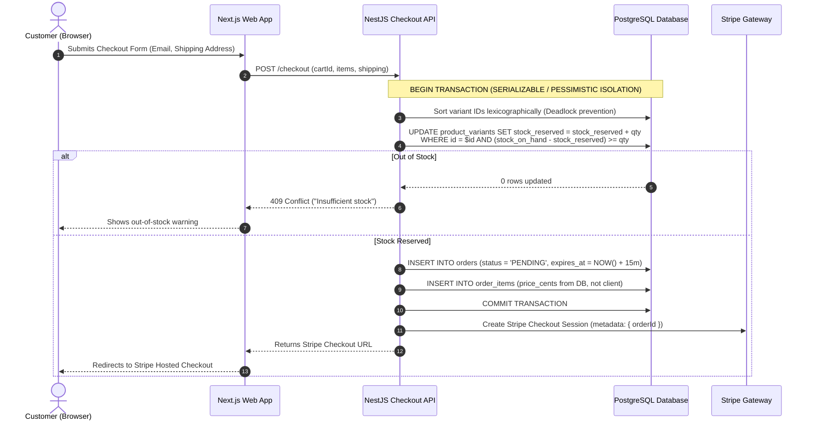
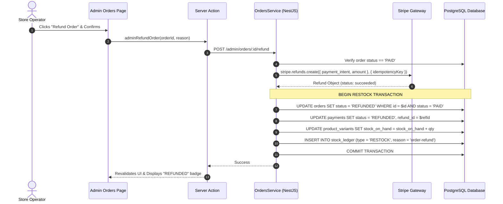

# Metfolio E-Commerce & Order Management System (OMS)
## Complete Technical Guide & System Architecture

Welcome to the **Metfolio E-Commerce & Order Management System** repository. This document is a complete walkthrough of everything in this project: how the code is structured, the anatomy of every user and admin journey, how we guarantee database consistency and prevent overselling during high-concurrency flash sales, how payment webhooks and refunds work with bulletproof idempotency, and where to find every piece of code.

---

## Table of Contents
1. [Repository Topology & Monorepo Structure](#1-repository-topology--monorepo-structure)
2. [End-to-End User Journeys (Customer Flow)](#2-end-to-end-user-journeys-customer-flow)
   - [2.1 Browsing & Product Discovery](#21-browsing--product-discovery)
   - [2.2 Cart Session & Anonymous-to-User State](#22-cart-session--anonymous-to-user-state)
   - [2.3 Checkout & Atomic Inventory Reservation](#23-checkout--atomic-inventory-reservation)
   - [2.4 Stripe Payment & Webhook Synchronization](#24-stripe-payment--webhook-synchronization)
   - [2.5 Customer Order Portal & Receipts](#25-customer-order-portal--receipts)
3. [End-to-End Admin Journeys (Operator Flow)](#3-end-to-end-admin-journeys-operator-flow)
   - [3.1 Admin Authentication & Surface Isolation](#31-admin-authentication--surface-isolation)
   - [3.2 Catalog & Product Variant Management](#32-catalog--product-variant-management)
   - [3.3 Live Stock Adjustments & Immutable Audit Ledger](#33-live-stock-adjustments--immutable-audit-ledger)
   - [3.4 Order Processing, Fulfillment & Shipping](#34-order-processing-fulfillment--shipping)
   - [3.5 Issuing Refunds & Automatic Restocking](#35-issuing-refunds--automatic-restocking)
4. [The Critical Edge Cases & Engineering Defenses](#4-the-critical-edge-cases--engineering-defenses)
   - [4.1 Preventing Flash-Sale Overselling (Double Selling)](#41-preventing-flash-sale-overselling-double-selling)
   - [4.2 Preventing Multi-Row Deadlocks (Deterministic Sorting)](#42-preventing-multi-row-deadlocks-deterministic-sorting)
   - [4.3 Two-Tier Reservation Expiry Sweeper](#43-two-tier-reservation-expiry-sweeper)
   - [4.4 Webhook Idempotency & Out-of-Order Delivery](#44-webhook-idempotency--out-of-order-delivery)
   - [4.5 Server-Authoritative Integer Pricing](#45-server-authoritative-integer-pricing)
   - [4.6 Row-Level Security (RLS) & Role Privilege Separation](#46-row-level-security-rls--role-privilege-separation)
   - [4.7 Timing Attack Mitigation & Bot Defense](#47-timing-attack-mitigation--bot-defense)
5. [Quick Navigation Index: Where is What?](#5-quick-navigation-index-where-is-what)

---

## 1. Repository Topology & Monorepo Structure

The project is structured as a high-performance monorepo managed with **pnpm workspaces** and **Turborepo**:

```
metfolio-assesment/
├── apps/
│   ├── api/                     # NestJS Core Backend (REST API, Redis, Business Logic)
│   │   └── src/
│   │       ├── admin/           # Admin Controller (Catalog, Stock, Fulfillment, Refunds)
│   │       ├── auth/            # JWT Guards, RolesGuard, Password hashing
│   │       ├── cart/            # Cart service & lines calculation
│   │       ├── catalog/         # Product queries & ISR on-demand revalidation
│   │       ├── checkout/        # Atomic order creation & inventory reservation
│   │       ├── inventory/       # Stock calculations, Ledger audit trail, Expiry sweeper
│   │       ├── orders/          # State machine, Order retrieval, Refund orchestration
│   │       └── webhooks/        # Stripe Webhook signature verification & dispatch
│   │
│   └── web/                     # Next.js 14 App Router (Storefront & Admin Dashboard)
│       ├── app/
│       │   ├── (shop)/          # Customer storefront (/, /products, /cart, /checkout, /orders)
│       │   ├── admin/           # Operator workspace (/admin, /products, /stock, /orders, /ledger)
│       │   ├── api/             # NextAuth handler & /api/nav-state route
│       │   └── auth-actions.ts  # Hybrid Server Actions (Supabase Auth + NextAuth fallback)
│       ├── components/          # Reusable UI widgets, forms, navbar, buttons
│       ├── lib/                 # API fetch wrappers, HMAC cart cookie, Supabase SSR client
│       ├── auth.ts              # Universal auth() session accessor
│       └── middleware.ts        # Supabase SSR cookie refresher
│
├── packages/
│   ├── db/                      # Prisma ORM & Database Layer
│   │   ├── prisma/schema.prisma # Database schema (Tables, Relations, Enums)
│   │   └── prisma/migrations/   # SQL migrations (Postgres CHECK constraints, Supabase RLS)
│   │
│   └── shared/                  # Universal Isomorphic Types & Pure Functions
│       └── src/
│           ├── contracts/       # Zod schemas, Order status state machine
│           ├── inventory/       # Pure stock arithmetic formulas
│           └── auth/            # Password strength scoring & validators
│
├── services/
│   ├── payments/                # Pluggable Payment Gateway Architecture
│   │   └── src/
│   │       ├── stripe-driver.ts # Production Stripe SDK (Checkout sessions, Refunds)
│   │       └── mock-driver.ts   # Deterministic Mock driver for offline testing & CI
│   ├── notifications/           # Transactional email engine & formatters
│   └── storage/                 # Local filesystem & S3 asset storage
│
└── e2e/                         # Playwright E2E Test Suite (Multi-browser, WCAG accessibility)
```

---

## 2. End-to-End User Journeys (Customer Flow)

### 2.1 Browsing & Product Discovery
1. **User visits `/` or `/products`**:
   - The storefront fetches products using `cachedApiFetch` ([`apps/web/lib/api.ts`](file:///Users/sap/Dev/projects/metfolio-assesment/apps/web/lib/api.ts)) with Next.js Incremental Static Regeneration (ISR).
   - Only active products with `status = 'ACTIVE'` are served to the user.
2. **Viewing a Product (`/products/[slug]`)**:
   - Displays all variants (colors, sizes), prices, and stock status.
   - If `stock_on_hand - stock_reserved <= 0`, the UI disables the "Add to Cart" button and renders an "Out of stock" pill.

### 2.2 Cart Session & Anonymous-to-User State
1. **Signed HMAC Cart Cookie**:
   - When an unauthenticated shopper adds a product to the cart, the browser creates a cryptographically signed cookie (`cart-id`) containing a UUID and an HMAC-SHA256 signature ([`apps/web/lib/cart-id.ts`](file:///Users/sap/Dev/projects/metfolio-assesment/apps/web/lib/cart-id.ts)).
   - **Why this matters**: A malicious user cannot tamper with the cookie or enumerate/hijack another customer's shopping cart.
2. **Cart Storage & Price Snapshotting**:
   - The cart is persisted on the backend. When products or quantities change, the backend validates variant availability and returns authoritative unit prices.

### 2.3 Checkout & Atomic Inventory Reservation
When the customer clicks **"Place Order"** on `/checkout`:



### 2.4 Stripe Payment & Webhook Synchronization
1. **Payment Submission**:
   - The customer enters credit card details on Stripe's PCI-DSS compliant checkout.
2. **Asynchronous Webhook Callback**:
   - Stripe sends a `checkout.session.completed` HTTP POST event to `/webhooks/stripe`.
   - The API verifies the raw payload with `stripe.webhooks.constructEvent` using `STRIPE_WEBHOOK_SECRET`.
3. **Database Transition**:
   - The webhook service records the event in `webhook_events` with the Stripe Event ID as the primary key. If the event was already received, it is immediately discarded.
   - The order transitions: `PENDING -> PAID`.
   - The stock moves from `stock_reserved` to finalized sale: `stock_on_hand` is decremented, `stock_reserved` is released, and a `SALE` entry is recorded in `stock_ledger`.
   - A confirmation email is dispatched via `services/notifications`.

### 2.5 Customer Order Portal & Receipts
1. Customer is redirected to `/orders/[id]`.
2. Under Supabase Row-Level Security (RLS), customers can only query rows where `customer_id = auth.uid()`.
3. Displays order lines, status badges (`PAID`, `FULFILLED`, `CANCELLED`, `REFUNDED`), shipping details, and tracking numbers.

---

## 3. End-to-End Admin Journeys (Operator Flow)

### 3.1 Admin Authentication & Surface Isolation
1. **Login (`/login`)**:
   - Operators log in with admin credentials.
   - Hybrid authentication resolves the user's role from Supabase metadata or DB profile.
2. **Visual & Psychological Surface Switch**:
   - Admin routes (`/admin/*`) are wrapped in `AdminLayout` ([`apps/web/app/admin/layout.tsx`](file:///Users/sap/Dev/projects/metfolio-assesment/apps/web/app/admin/layout.tsx)) with `data-surface="admin"`.
   - This switches the storefront from warm paper styling to a cool slate tone with high-density data tables and monospace numeric values.
   - **Why this matters**: An operator can immediately tell whether they are editing live production inventory or viewing the customer storefront.

### 3.2 Catalog & Product Variant Management
1. **Route**: `/admin/products` & `/admin/products/[id]`.
2. **Operations**: Create products, add variants (SKU, title, price in cents), upload images, and set statuses (`ACTIVE`, `DRAFT`, `ARCHIVED`).
3. **Cache Invalidation**:
   - Modifying a product triggers Next.js `revalidateTag('catalog')`, which instantly purges the stale ISR cache on the edge so customers see fresh pricing immediately.

### 3.3 Live Stock Adjustments & Immutable Audit Ledger
1. **Route**: `/admin/stock` & `/admin/ledger`.
2. **Direct Stock Adjustments**:
   - Admins can restock inventory or write off damaged items.
   - **Zero Silent Edits**: Operators can never overwrite `stock_on_hand` with a raw UPDATE statement.
   - Every modification appends an entry to the append-only `stock_ledger` table with:
     - `quantity_delta` (+10, -2)
     - `reason` (`RESTOCK`, `MANUAL_ADJUSTMENT`, `AUDIT_CORRECTION`)
     - `performed_by` (Admin user ID)
     - `created_at` timestamp
3. **Auditability**:
   - At any time, summing the audit ledger entries for a variant yields the current `stock_on_hand`. If a discrepancy exists, it is instantly caught.

### 3.4 Order Processing, Fulfillment & Shipping
1. **Route**: `/admin/orders`.
2. Filter orders by status pills: `ALL`, `PENDING`, `PAID`, `FULFILLED`, `REFUNDED`.
3. When shipping items:
   - Admin clicks **"Fulfill Order"** and enters a carrier tracking code.
   - State transition: `PAID -> FULFILLED`.
   - Automated notification service emails the customer their tracking link.

### 3.5 Issuing Refunds & Automatic Restocking
When a customer requests a refund or an order is cancelled:



---

## 4. The Critical Edge Cases & Engineering Defenses

### 4.1 Preventing Flash-Sale Overselling (Double Selling)
- **The Problem**: If 1 item is left and 10 shoppers click "Buy" at the exact same millisecond, naive applications read `stock = 1`, proceed to payment for all 10, and oversell by 9 units.
- **Our Defense**:
  1. We execute an engine-level atomic conditional decrement:
     ```sql
     UPDATE "product_variants"
        SET "stock_reserved" = "stock_reserved" + $quantity,
            "updated_at" = NOW()
      WHERE "id" = $variantId
        AND ("stock_on_hand" - "stock_reserved") >= $quantity;
     ```
  2. If the row count is `0`, the database guarantees insufficient stock without race conditions.
  3. We enforce a Postgres `CHECK` constraint:
     ```sql
     ALTER TABLE "product_variants"
     ADD CONSTRAINT "stock_never_negative"
     CHECK ("stock_reserved" <= "stock_on_hand" AND "stock_reserved" >= 0);
     ```

### 4.2 Preventing Multi-Row Deadlocks (Deterministic Sorting)
- **The Problem**: Customer A buys Variant 1 then Variant 2. Customer B buys Variant 2 then Variant 1. Transaction A locks Variant 1 and waits for Variant 2. Transaction B locks Variant 2 and waits for Variant 1. **Deadlock!** Both transactions crash.
- **Our Defense**:
  - In [`apps/api/src/checkout/checkout.service.ts`](file:///Users/sap/Dev/projects/metfolio-assesment/apps/api/src/checkout/checkout.service.ts), before any row lock is requested, the items in the cart are sorted deterministically by their primary key:
    ```typescript
    const sortedLines = [...lines].sort((a, b) => a.variantId.localeCompare(b.variantId));
    ```
  - Every transaction in the system acquires locks in the exact same global order. Cyclic wait conditions become mathematically impossible.

### 4.3 Two-Tier Reservation Expiry Sweeper
- **The Problem**: A customer reserves items, reaches Stripe checkout, and abandons their browser tab. The inventory remains reserved forever, depriving genuine buyers.
- **Our Defense**:
  1. Reservations have an `expires_at = NOW() + 15 minutes`.
  2. In [`apps/api/src/inventory/reservation-sweep.service.ts`](file:///Users/sap/Dev/projects/metfolio-assesment/apps/api/src/inventory/reservation-sweep.service.ts), a background cron job runs every 60 seconds.
  3. It queries all expired `PENDING` orders and atomic releases the reservation:
     ```sql
     UPDATE "product_variants"
        SET "stock_reserved" = "stock_reserved" - $quantity
      WHERE "id" = $variantId;
     ```
  4. The order status is transitioned to `EXPIRED`.
  5. The sweeper is backed by a Redis distributed lock (`redlock`), ensuring that even if 5 backend containers are running, only one executes the sweep at a time.

### 4.4 Webhook Idempotency & Out-of-Order Delivery
- **The Problem**: Stripe may deliver the same webhook twice, or deliver `charge.refunded` before `checkout.session.completed` due to network delays.
- **Our Defense**:
  1. **Primary Key Deduping**: Webhook events are inserted into `webhook_events` with the Stripe Event ID as primary key. Duplicates fail with unique constraint violations.
  2. **Guarded State Machine**: The order state machine only permits valid forward transitions:
     ```
     PENDING -> PAID -> FULFILLED
     PAID -> REFUNDED
     PENDING -> CANCELLED / EXPIRED
     ```
  3. If an event attempts an illegal transition (e.g. `REFUNDED -> PAID`), the database query modifies 0 rows and exits cleanly.

### 4.5 Server-Authoritative Integer Pricing
- **The Problem**: Floating point errors (`0.1 + 0.2 = 0.30000000000000004`) lead to rounding errors, and client-submitted prices can be modified using browser developer tools.
- **Our Defense**:
  1. Prices are strictly stored and computed as integer cents (`$19.99` is stored as `1999`).
  2. The client never supplies unit prices to the API during checkout. The API queries the database for authoritative variant pricing and calculates line totals server-side.

### 4.6 Row-Level Security (RLS) & Role Privilege Separation
- **The Problem**: Leaked database credentials or public API access might allow users to view other people's orders or dump customer lists.
- **Our Defense**:
  - In [`packages/db/prisma/migrations/20260914180000_supabase_rls_and_profiles`](file:///Users/sap/Dev/projects/metfolio-assesment/packages/db/prisma/migrations/20260914180000_supabase_rls_and_profiles/migration.sql), we configure PostgreSQL Row-Level Security:
    - `anon`: Can only `SELECT` active products.
    - `customer`: Can only `SELECT` orders where `customer_id = auth.uid()`. Can never view `stock_ledger` or internal notes.
    - `admin`: Full read/write access guarded by a secure `is_admin()` function with explicit `search_path = public` to prevent search-path injection.

### 4.7 Timing Attack Mitigation & Bot Defense
- **The Problem**:
  - Attackers measure server response times to discover whether an email exists in the database.
  - Bots spam signups and exhaust database resources.
- **Our Defense**:
  1. **Constant-Time Verification**: When authenticating with a non-existent email, [`apps/api/src/auth/auth.service.ts`](file:///Users/sap/Dev/projects/metfolio-assesment/apps/api/src/auth/auth.service.ts) hashes a dummy password using `bcrypt.compare` to ensure the response time is indistinguishable from a real account check.
  2. **Honeypot Fields**: The signup form includes a hidden `company` input that humans never see, but autocomplete bots populate, immediately dropping malicious submissions.
  3. **Timing Heuristics**: Form submissions taking less than 2 seconds between render and submit are rejected as automated bots.

---

## 5. Quick Navigation Index: Where is What?

| Feature / Domain | Key Source Files |
| :--- | :--- |
| **Checkout & Concurrency** | [`apps/api/src/checkout/checkout.service.ts`](file:///Users/sap/Dev/projects/metfolio-assesment/apps/api/src/checkout/checkout.service.ts)<br/>[`apps/api/src/inventory/inventory.service.ts`](file:///Users/sap/Dev/projects/metfolio-assesment/apps/api/src/inventory/inventory.service.ts) |
| **Stripe & Mock Payments** | [`services/payments/src/stripe-driver.ts`](file:///Users/sap/Dev/projects/metfolio-assesment/services/payments/src/stripe-driver.ts)<br/>[`services/payments/src/mock-driver.ts`](file:///Users/sap/Dev/projects/metfolio-assesment/services/payments/src/mock-driver.ts) |
| **Refunds & Restock Ledger** | [`apps/api/src/orders/orders.service.ts`](file:///Users/sap/Dev/projects/metfolio-assesment/apps/api/src/orders/orders.service.ts)<br/>[`apps/web/components/refund-button.tsx`](file:///Users/sap/Dev/projects/metfolio-assesment/apps/web/components/refund-button.tsx) |
| **Webhooks & Idempotency** | [`apps/api/src/webhooks/webhooks.service.ts`](file:///Users/sap/Dev/projects/metfolio-assesment/apps/api/src/webhooks/webhooks.service.ts)<br/>[`apps/api/src/webhooks/webhooks.controller.ts`](file:///Users/sap/Dev/projects/metfolio-assesment/apps/api/src/webhooks/webhooks.controller.ts) |
| **Reservation Sweeper** | [`apps/api/src/inventory/reservation-sweep.service.ts`](file:///Users/sap/Dev/projects/metfolio-assesment/apps/api/src/inventory/reservation-sweep.service.ts) |
| **Auth & Sessions** | [`apps/web/auth.ts`](file:///Users/sap/Dev/projects/metfolio-assesment/apps/web/auth.ts)<br/>[`apps/web/app/auth-actions.ts`](file:///Users/sap/Dev/projects/metfolio-assesment/apps/web/app/auth-actions.ts)<br/>[`apps/web/middleware.ts`](file:///Users/sap/Dev/projects/metfolio-assesment/apps/web/middleware.ts) |
| **Admin UI & Gates** | [`apps/web/app/admin/layout.tsx`](file:///Users/sap/Dev/projects/metfolio-assesment/apps/web/app/admin/layout.tsx)<br/>[`apps/web/app/admin/orders/page.tsx`](file:///Users/sap/Dev/projects/metfolio-assesment/apps/web/app/admin/orders/page.tsx)<br/>[`apps/web/app/admin/stock/page.tsx`](file:///Users/sap/Dev/projects/metfolio-assesment/apps/web/app/admin/stock/page.tsx) |
| **Database & RLS** | [`packages/db/prisma/schema.prisma`](file:///Users/sap/Dev/projects/metfolio-assesment/packages/db/prisma/schema.prisma)<br/>[`packages/db/prisma/migrations/20260914180000_supabase_rls_and_profiles/migration.sql`](file:///Users/sap/Dev/projects/metfolio-assesment/packages/db/prisma/migrations/20260914180000_supabase_rls_and_profiles/migration.sql) |
| **Contracts & State Machine**| [`packages/shared/src/contracts/index.ts`](file:///Users/sap/Dev/projects/metfolio-assesment/packages/shared/src/contracts/index.ts) |
| **E2E Playwright Suite** | [`e2e/tests/admin.spec.ts`](file:///Users/sap/Dev/projects/metfolio-assesment/e2e/tests/admin.spec.ts)<br/>[`e2e/tests/oversell.spec.ts`](file:///Users/sap/Dev/projects/metfolio-assesment/e2e/tests/oversell.spec.ts)<br/>[`e2e/tests/a11y.spec.ts`](file:///Users/sap/Dev/projects/metfolio-assesment/e2e/tests/a11y.spec.ts) |

---
*Created for the Metfolio Technical Assessment.*
